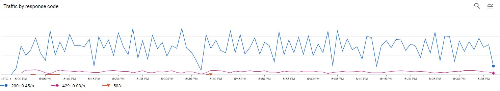
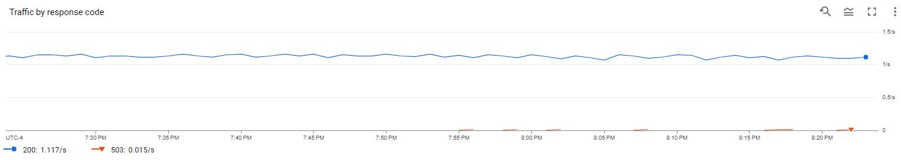

# Gmail Contacts Cleanup

This program started as an exploration into python, and like any project where the intention is to learn I wanted to solve a real problem.

Years ago I enrolled with a leadership development group and through my volunteering efforts was given access to their student records.

As a volunteer and active member of the community I wanted to have quick access to phone numbers in the event of an emergency or other event that would justify a phone call.

In the process of loading up this student database of roughly 15,000 records to my Google Contacts, I neglected to account for the impact it would have on all the other services that integrate with my phone contacts.

For example, messaging apps like WhatsApp, or Facebook Messenger, will scan records from the contact list of the device to find adjacent contacts to connect with.

## Record Management

Google makes it easy to add records in bulk with a CSV import tool, but a manual batch delete was not going to work for me.

The main challenge was related to _data quality_.

During my time within this community, I developed many friendships and needed to keep these "records" while removing the ones that I didn't have a personal connection with.

Thankfully, when I imported this data into my contacts I gave them all a shared label. This meant that at the very least I could delete all records under this label, but an issue was that this would also remove records of my friends.

I started examining the data for criteria I could use to isolate the personal records within the larger set of data. To do this, I developed a set of criteria:

1. If a record has more than one phone number, keep it
2. If a record has more than one label, keep it
3. If a record has a phone number, and it was labeled (ie _Mobile, Work, Office_), keep it

With these criteria validated I began to develop the code.

## Chain of responsibility

The Chain of responsibility pattern is used to pass a data object from one _handler_ to another.

In my case, I wanted to pass the contact record through a series of criteria so that each could be checked and any hits would stop the progression.

In code, we can define a generic, or _Abstract_, class for our handler like this

```py
class AbstractHandler(Handler):
    _next_handler = None

    def set_next(self, handler):
        self._next_handler = handler
        return handler

    def handle(self, contact):
        if self._next_handler:
            return self._next_handler.handle(contact)
```

This is doing two things

1. Defining a way to set _the next handler in line_.
2. Defining a way to manage the contact record if it is this handler's turn.

With these basics in place, I moved on to a _concrete_ handler, or one that was really meant to handle data:

```py
# Condition 1: Any phone number of the record has a label
class PhoneNumberWithLabelHandler(AbstractHandler):
    def handle(self, contact):
        phone_numbers = contact.get("phoneNumbers", [])
        if any("contactGroupMembership" in phone for phone in phone_numbers):
            return ("Skipped", "Phone number has a label")
        return super().handle(contact)
```

Notice here that `set_next` is absent. That's because it has already been defined by the abstract class and is _inherited_ by this new class.

Inside this class is the specific logic needed to determine if the phone number has a label.

Now I can create instances of each of these filters:

```py
phone_number_with_label_handler = PhoneNumberWithLabelHandler()
multiple_phone_numbers_handler = MultiplePhoneNumbersHandler()
multiple_labels_handler = MultipleLabelsHandler()
```

And chain them together by calling `.set_next()` on each:

```py
def record_filters():
    multiple_phone_numbers_handler.set_next(multiple_labels_handler)
    phone_number_with_label_handler.set_next(multiple_phone_numbers_handler)
    return phone_number_with_label_handler
```

With these filters chained together, any one of them can stop the processing and mark the record as important so it doesn't get deleted.

This logic is seen here

```py
        result = record_filters().handle(contact)
        if result:
            skipped_contacts.append(contact)
        else:
            to_delete_contacts.append(contact)
```

## API Limits

One of the issues I ran into with this project was Google's API rate limit.

I first encountered this as a 429 HTTP error code and chose to implement a retry-with-pause approach.

On the first instance of an error I defined a wait of 2 seconds. If an error still triggered, the program would wait 4 seconds, then 8 seconds, and so on.

```py
        try:
            ...
        except HttpError as error:
            if error.resp.status in (503, 429) and retries < max_retries:
                print(f"Error {error.resp.status}.")
                print(f"  Retrying in {backoff_time} seconds...")
                time.sleep(backoff_time)
                retries += 1
                backoff_time *= 2
```

This approach worked, and seeing the console output of my program waiting for it's next turn was pretty exciting.

What this didn't take into account though, was the actual limit of the API. This led to erratic behavior of my program. In the chart below, the blue line is the number of calls my program made to the API, and the purple line are the errors telling me it's limited.



This was a very reactive solution and I wanted to be more intentional about how I was calling the API.

### The Decorator Pattern

A Decorator is a chuck of logic that wraps other logic to add functionality. In my case, I wanted to decorate an API call with the ability to _wait as little as possible_ to meet a specific number of calls per min.

In the case of the Google API, the limit is 90 calls per minute.

To stay compliant the logic needs to:

1. Calculate the minimum time interval between calls to stay under the API limit
1. Track the time between each iteration and the previous API call
1. Calculate if any pause is needed before executing a new API call
1. Then wait _only long enough to stay compliant_.

Written out, using the decorator pattern, this is the function

```py
def rate_limited_calls_per_min(max_per_minute):
    min_interval = 60.0 / float(max_per_minute)

    def decorate(func):
        last_time_called = [0.0]

        @wraps(func)
        def rate_limited_function(*args, **kwargs):
            elapsed = time.perf_counter() - last_time_called[0]
            left_to_wait = min_interval - elapsed
            if left_to_wait > 0:
                time.sleep(left_to_wait)
            ret = func(*args, **kwargs)
            last_time_called[0] = time.perf_counter()
            return ret

        return rate_limited_function

    return decorate
```

The next step was to isolate the code that's actually making the API call so that it, and only it, are being timed by the decorator.

This meant changing from this

```py
            try:
                print(
                    f"Deleting {index + 1} of {total_contacts}: {contact['resourceName']}"
                )

                service.people().deleteContact(resourceName=contact_resource_name).execute()
                break
```

to this

```py
@rate_limited_calls_per_min(90)
def delete_contact_api_call(service, contact_resource_name):
    service.people().deleteContact(resourceName=contact_resource_name).execute()
```

```py
    ...
            try:
                print(
                    f"Deleting {index + 1} of {total_contacts}: {contact['resourceName']}"
                )

                delete_contact_api_call(service, contact["resourceName"])
                break
```

The results were exactly what I wanted to see, a smooth and consistent trend line of API calls:



## Optimizations

From here there are a few opportunities to optimize the code - mainly around the API interactions. Too much responsibility within a single method and these could be broken out into more appropriate domain classes. One of the challenges of my career as an engineer is a tendency to over optimize and not be satisfied by _enough to get the job done._ With that in mind, I think I'll leave this as is and enjoy a clean address book after nearly a decade of ignoring the mess.
